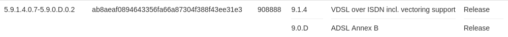

# Modem

I prefer keeping the modem as stupid as possible to provide a small attack surface. Thus, I am building my own firmware with OpenWrt's [Image Builder](https://openwrt.org/docs/guide-user/additional-software/imagebuilder).

```bash
local $ ls -1 
openwrt-19.07.7-lantiq-xrx200-avm_fritz3370-rev2-hynix-squashfs-sysupgrade.bin
openwrt-imagebuilder-19.07.7-lantiq-xrx200.Linux-x86_64.tar.xz
sha256sums
sha256sums.asc
vr9-B-dsl.bin
```

Above files are downloaded from [openwrt.org](https://downloads.openwrt.org/releases/19.07.7/targets/lantiq/xrx200/) and `vr9-B-dsl.bin` is extracted with the help of [xdarklight](https://xdarklight.github.io/lantiq-xdsl-firmware-info/):



## Official sysupgrade .bin

Flash the official sysupgrade .bin:

```bash
remote $ sha256sum /tmp/openwrt-19.07.7-lantiq-xrx200-avm_fritz
3370-rev2-hynix-squashfs-sysupgrade.bin | grep cc79df99be39ba4ff675aaf8f60e8cedb4eef4373ec2fc5b3e803bc5cfe15652
remote $ sysupgrade -n -v /tmp/openwrt-19.07.7-lantiq-xrx200-avm_fritz3370-rev2-hynix-squashfs-sysupgrade.bin 
Commencing upgrade. Closing all shell sessions.
Connection to 192.168.0.254 closed by remote host.
Connection to 192.168.0.254 closed.
```

..., ssh into your modem after reboot with `ssh root@192.168.1.1` and list packages without any dependencies:

```bash
remote $ opkg list-installed | awk '{print $1}' | while read I; do if [ $(opkg whatdepends "$I" | wc -l) -eq 3 ]; then echo "$I"; fi; done
base-files
busybox
dnsmasq
dropbear
dsl-vrx200-firmware-xdsl-b-patch
fritz-tffs
ip6tables
iwinfo
kmod-ath9k
kmod-gpio-button-hotplug
kmod-ipt-offload
kmod-leds-gpio
kmod-ltq-atm-vr9
kmod-ltq-deu-vr9
kmod-ltq-ptm-vr9
kmod-usb-dwc2
logd
ltq-vdsl-app
ltq-vdsl-vr9-vectoring-fw-installer
luci
mtd
odhcp6c
odhcpd-ipv6only
ppp
ppp-mod-pppoa
ppp-mod-pppoe
swconfig
uci
urandom-seed
urngd
wpad-basic
```

## Image Builder sysupgrade .bin w/o modifications

Use the OpenWrt's [Image Builder](https://openwrt.org/docs/guide-user/additional-software/imagebuilder) ...:

```bash
local $ tar xvf openwrt-imagebuilder-19.07.7-lantiq-xrx200.Linux-x86_64.tar.xz; echo $?
local $ cd openwrt-imagebuilder-19.07.7-lantiq-xrx200.Linux-x86_64/
local $ make help
local $ make image PROFILE="avm_fritz3370-rev2-hynix"; echo $?
local $ scp bin/targets/lantiq/xrx200/openwrt-19.07.7-lantiq-xrx200-avm_fritz3370-rev2-hynix-squashfs-sysupgrade.bin root@192.168.1.1:/tmp/
local $ grep "openwrt-19.07.7-lantiq-xrx200-avm_fritz3370-rev2-hynix-squashfs-sysupgrade.bin" bin/targets/lantiq/xrx200/sha256sums | sed 's#*# /tmp/#' | ssh root@192.168.1.1 "dd of=/tmp/sha256.txt"
```

..., flash your modem:

```bash
remote $ sha256sum -c /tmp/sha256.txt 
/tmp/openwrt-19.07.7-lantiq-xrx200-avm_fritz3370-rev2-hynix-squashfs-sysupgrade.bin: OK
remote $ sysupgrade -n -v /tmp/openwrt-19.07.7-lantiq-xrx200-avm_fritz3370-rev2-hynix-squashfs-sysupgrade.bin
Commencing upgrade. Closing all shell sessions.
Connection to 192.168.1.1 closed by remote host.
Connection to 192.168.1.1 closed.
```

... and create the package list again:

```bash
remote $ opkg list-installed | awk '{print $1}' | while read I; do if [ $(opkg whatdepends "$I" | wc -l) -eq 3 ]; then echo "$I"; fi; done
base-files
busybox
dnsmasq
dropbear
dsl-vrx200-firmware-xdsl-b-patch
firewall
fritz-tffs
ip6tables
iwinfo
kmod-ath9k
kmod-gpio-button-hotplug
kmod-ipt-offload
kmod-leds-gpio
kmod-ltq-atm-vr9
kmod-ltq-deu-vr9
kmod-ltq-ptm-vr9
kmod-usb-dwc2
logd
ltq-vdsl-app
ltq-vdsl-vr9-vectoring-fw-installer
mtd
odhcp6c
odhcpd-ipv6only
opkg
ppp
ppp-mod-pppoa
ppp-mod-pppoe
swconfig
uci
urandom-seed
urngd
wpad-basic
```

## Minimalistic sysupgrade .bin

**Now, you have an overview of what packages above two images come with.**

As already mentioned, I use a minimalistic image which I preconfigure with below files and folders. My `files` folder (without `vr9-B-dsl.bin` due to copyright) is stored in this repo at `modem/files`. I recommend comparing the files in `files/etc/config` with those pulled from your modem running OpenWrt's [Image Builder sysupgrade .bin w/o modifications](#image-builder-sysupgrade-bin-wo-modifications). Read my comments within the config files and make sure to understand my changes with the help of the official OpenWrt docs.

Make sure that correct permissions are set with `chmod`:

```bash
local $ find files -exec ls -ld {} + | awk '{print $1"  "$NF}'
drwxr-xr-x  files
drwxr-xr-x  files/etc
drwxr-xr-x  files/etc/config
-rw-------  files/etc/config/network
-rw-------  files/etc/config/system
drwxr-xr-x  files/lib
drwxr-xr-x  files/lib/firmware
-r--r--r--  files/lib/firmware/vr9-B-dsl.bin
```

While building the image with OpenWrt's Image Builder, you have to explicitly exclude the packages you don't want to have. I create my bare minimum image as follows:

```bash
local $ tar xvf openwrt-imagebuilder-19.07.7-lantiq-xrx200.Linux-x86_64.tar.xz; echo $?
local $ cd openwrt-imagebuilder-19.07.7-lantiq-xrx200.Linux-x86_64/
local $ make help
local $ make image PROFILE="avm_fritz3370-rev2-hynix" PACKAGES="-dnsmasq -dsl-vrx200-firmware-xdsl-a -dsl-vrx200-firmware-xdsl-b-patch -firewall -ip6tables -iptables -iwinfo -kmod-ath9k -kmod-gpio-button-hotplug -kmod-ipt-offload -kmod-leds-gpio -kmod-ltq-atm-vr9 -kmod-ltq-deu-vr9 -kmod-usb-dwc2 -ltq-vdsl-vr9-vectoring-fw-installer -odhcp6c -odhcpd-ipv6only -ppp -ppp-mod-pppoa -ppp-mod-pppoe -wpad-basic" FILES="files/"; echo $?
local $ scp bin/targets/lantiq/xrx200/openwrt-19.07.7-lantiq-xrx200-avm_fritz3370-rev2-hynix-squashfs-sysupgrade.bin root@192.168.1.1:/tmp/
local $ grep "openwrt-19.07.7-lantiq-xrx200-avm_fritz3370-rev2-hynix-squashfs-sysupgrade.bin" bin/targets/lantiq/xrx200/sha256sums | sed 's#*# /tmp/#' | ssh root@192.168.1.1 "dd of=/tmp/sha256.txt"
```

You can get some info on a certain package at `https://openwrt.org/packages/pkgdata/<PACKAGE_NAME>` (e.g. https://openwrt.org/packages/pkgdata/urngd).

Flash the image:

```bash
remote $ sha256sum -c /tmp/sha256.txt
/tmp/openwrt-19.07.7-lantiq-xrx200-avm_fritz3370-rev2-hynix-squashfs-sysupgrade.bin: OK
remote $ sysupgrade -n -v /tmp/openwrt-19.07.7-lantiq-xrx200-avm_fritz3370-rev2-hynix-squashfs-sysupgrade.bin
Commencing upgrade. Closing all shell sessions.
Connection to 192.168.1.1 closed by remote host.
Connection to 192.168.1.1 closed.
```

After reboot, login via `ssh root@192.168.1.1`, set a password and optionally harden login over serial port. **Keep below SSH session running and `ssh` into the modem in another terminal to make sure that you really have access to the device with your newly set password.** The AVM Fritzbox 3370 doesn't have a reset button, and you need to go into failsafe mode over the serial port if you are locked out.


```bash
remote $ passwd
Changing password for root
New password:
Retype password:
passwd: password for root changed by root
remote $ sed -i "s/option ttylogin.*/option ttylogin '1'/" /etc/config/system # to enforce prompt for root password over serial port
```

And here is my bare minimum package list:

```bash
remote $ opkg list-installed | awk '{print $1}' | while read I; do if [ $(opkg whatdepends "$I" | wc -l) -eq 3 ]; then echo "$I"; fi; done
base-files
busybox
dropbear
fritz-tffs
kmod-ltq-ptm-vr9
kmod-ltq-vdsl-vr9
logd
ltq-vdsl-app
mtd
opkg
swconfig
uci
urandom-seed
urngd
```