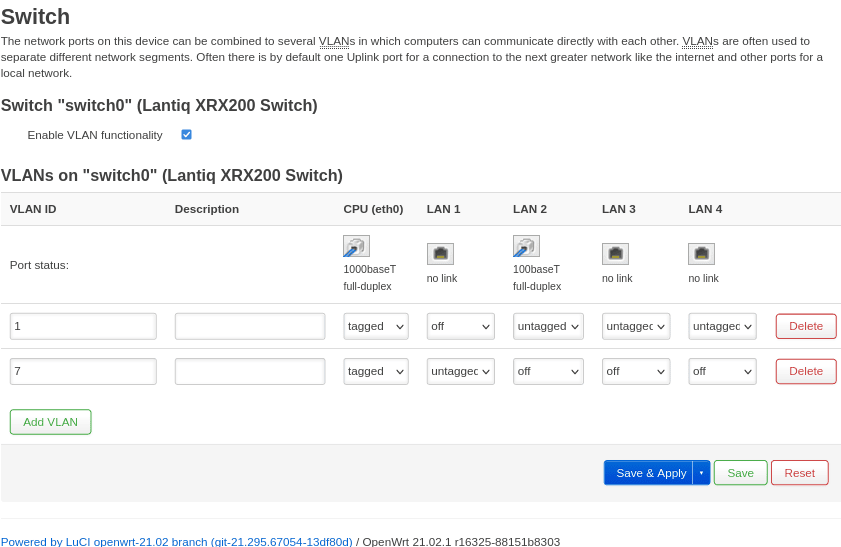

# Modem

I prefer keeping the modem as stupid as possible to provide a small attack surface. Thus, I am building my own firmware with OpenWrt's [Image Builder](https://openwrt.org/docs/guide-user/additional-software/imagebuilder).

```bash
local $ ls -1
openwrt-21.02.1-lantiq-xrx200-avm_fritz3370-rev2-hynix-squashfs-sysupgrade.bin
openwrt-imagebuilder-21.02.1-lantiq-xrx200.Linux-x86_64.tar.xz
sha256sums
sha256sums.asc
vr9-B-dsl.bin
```

⚠️ Use the `micron` flavour if you have a Micron NAND flash chip. ⚠️

Above files are downloaded from [openwrt.org](https://downloads.openwrt.org/releases/21.02.1/targets/lantiq/xrx200/), and `vr9-B-dsl.bin` is extracted with the help of [xdarklight](https://xdarklight.github.io/lantiq-xdsl-firmware-info/):


In order to get the `unsquashfs4-avm-be` you need to do:

```bash
local $ git clone https://github.com/Freetz/freetz.git
local $ cd freetz
local $ make menuconfig # just save, no modifications required
local $ make tools
```

## Official sysupgrade .bin

Flash the official sysupgrade .bin:

```bash
remote $ sha256sum /tmp/openwrt-21.02.1-lantiq-xrx200-avm_fritz3370-rev2-hynix-squashfs-sysupgrade.bin | grep f381906a218e5e2b865951904186531fc118b8eef6ce6035da2de74618d6fe81
remote $ sysupgrade -n -v /tmp/openwrt-21.02.1-lantiq-xrx200-avm_fritz3370-rev2-hynix-squashfs-sysupgrade.bin
Commencing upgrade. Closing all shell sessions.
Connection to 192.168.0.254 closed by remote host.
Connection to 192.168.0.254 closed.
```

..., ssh into your modem after reboot with `ssh root@192.168.1.1` and list packages without any dependencies:

```bash
remote $ opkg list-installed | awk '{print $1}' | while read I; do if [ $(opkg whatdepends "$I" | wc -l) -eq 3 ]; then echo "$I"; fi; done
base-files
busybox
ca-bundle
dnsmasq
dropbear
dsl-vrx200-firmware-xdsl-b-patch
fritz-tffs
ip6tables
iwinfo
kmod-ath9k
kmod-gpio-button-hotplug
kmod-ipt-offload
kmod-leds-gpio
kmod-ltq-atm-vr9
kmod-ltq-ptm-vr9
kmod-usb-dwc2
logd
ltq-vdsl-app
ltq-vdsl-vr9-vectoring-fw-installer
luci-ssl
mtd
odhcp6c
odhcpd-ipv6only
ppp
ppp-mod-pppoa
ppp-mod-pppoe
procd
swconfig
uci
urandom-seed
urngd
wpad-basic-wolfssl
```

## Image Builder sysupgrade .bin w/o modifications

Use OpenWrt's [Image Builder](https://openwrt.org/docs/guide-user/additional-software/imagebuilder) ...:

```bash
local $ tar xvf openwrt-imagebuilder-21.02.1-lantiq-xrx200.Linux-x86_64.tar.xz; echo $?
local $ cd openwrt-imagebuilder-21.02.1-lantiq-xrx200.Linux-x86_64/
local $ make help
local $ make image PROFILE="avm_fritz3370-rev2-hynix"; echo $?
local $ scp bin/targets/lantiq/xrx200/openwrt-21.02.1-lantiq-xrx200-avm_fritz3370-rev2-hynix-squashfs-sysupgrade.bin root@192.168.1.1:/tmp/
local $ grep "openwrt-21.02.1-lantiq-xrx200-avm_fritz3370-rev2-hynix-squashfs-sysupgrade.bin" bin/targets/lantiq/xrx200/sha256sums | sed 's#*# /tmp/#' | ssh root@192.168.1.1 "dd of=/tmp/sha256.txt"
```

..., flash your modem:

```bash
remote $ sha256sum -c /tmp/sha256.txt
/tmp/openwrt-21.02.1-lantiq-xrx200-avm_fritz3370-rev2-hynix-squashfs-sysupgrade.bin: OK
remote $ sysupgrade -n -v /tmp/openwrt-21.02.1-lantiq-xrx200-avm_fritz3370-rev2-hynix-squashfs-sysupgrade.bin
Commencing upgrade. Closing all shell sessions.
Connection to 192.168.1.1 closed by remote host.
Connection to 192.168.1.1 closed.
```

... and create the package list without dependencies again:

```bash
remote $ opkg list-installed | awk '{print $1}' | while read I; do if [ $(opkg whatdepends "$I" | wc -l) -eq 3 ]; then echo "$I"; fi; done
base-files
busybox
ca-bundle
dnsmasq
dropbear
dsl-vrx200-firmware-xdsl-b-patch
firewall
fritz-tffs
ip6tables
iwinfo
kmod-ath9k
kmod-gpio-button-hotplug
kmod-ipt-offload
kmod-leds-gpio
kmod-ltq-atm-vr9
kmod-ltq-ptm-vr9
kmod-usb-dwc2
libustream-wolfssl20201210
logd
ltq-vdsl-app
ltq-vdsl-vr9-vectoring-fw-installer
mtd
odhcp6c
odhcpd-ipv6only
opkg
ppp
ppp-mod-pppoa
ppp-mod-pppoe
procd
swconfig
uci
urandom-seed
urngd
wpad-basic-wolfssl
```

## Minimalistic sysupgrade .bin

### Create configuration with luci

**Now, you have an overview of what packages above two images come with.**

As already mentioned, I use a minimalistic image. In order determine suitable configuration settings, I install the official sysupgrade image first and slim down the configuration in `luci` as shown in the follwing subchapters.

#### System -> System

The modem doesn't need NTP:

```
# /etc/config/system
uci del system.cfg01e48a.timezone
uci del system.ntp.enable_server
uci del system.ntp.server
uci set system.cfg01e48a.hostname='avm'
uci set system.cfg01e48a.zonename='UTC'
uci set system.cfg01e48a.log_proto='udp'
uci set system.cfg01e48a.conloglevel='8'
uci set system.cfg01e48a.cronloglevel='5'
uci set system.ntp.enabled='0'
```

#### Network -> Switch

Configure the switch as follows to provide a dedicated ethernet port for PPPoE:



```
# /etc/config/network
uci add network switch_vlan # =cfg0d1ec7
uci set network.@switch_vlan[-1].device='switch0'
uci set network.@switch_vlan[-1].vlan='2'
uci set network.cfg0c1ec7.vid='1'
uci set network.cfg0c1ec7.ports='0 1 2 6t'
uci set network.@switch_vlan[-1].ports='4 6t'
uci set network.@switch_vlan[-1].vid='7'
```

#### Network -> Interfaces

Delete "WAN6":

```
# /etc/config/firewall
uci del firewall.cfg02dc81.network
uci add_list firewall.cfg02dc81.network='lan'
uci del firewall.cfg03dc81.network
uci add_list firewall.cfg03dc81.network='wan'
# /etc/config/network
uci del network.wan6
uci set network.dsl.ds_snr_offset='0'
```

#### Network -> Interfaces -> LAN

```
# /etc/config/dhcp
uci del dhcp.lan.ra
uci del dhcp.lan.ra_slaac
uci del dhcp.lan.dhcpv6
uci set dhcp.lan.ignore='1'
uci set dhcp.lan.dynamicdhcp='0'
uci del dhcp.lan.ra_flags
uci add_list dhcp.lan.ra_flags='none'
# /etc/config/firewall
uci del firewall.cfg02dc81.network
# /etc/config/network
uci del network.lan.ip6assign
uci set network.lan.device='eth0.1'
```

#### Network -> Devices

Delete `br-lan`:

```
# /etc/config/network
uci del network.cfg050f15
```

Create `br-wan`:

```
# /etc/config/network
uci add network device # =cfg0c0f15
uci set network.@device[-1].type='bridge'
uci set network.@device[-1].name='br-wan'
uci add_list network.@device[-1].ports='eth0.7'
uci add_list network.@device[-1].ports='dsl0.7'
```

#### Network -> Interfaces -> WAN

```
# /etc/config/dhcp
uci add_list dhcp.wan.ra_flags='none'
uci del dhcp.wan.ra_flags
uci add_list dhcp.wan.ra_flags='none'
# /etc/config/firewall
uci del firewall.cfg03dc81.network
# /etc/config/network
uci del network.wan.username
uci del network.wan.password
uci del network.wan.ipv6
uci set network.wan.proto='none'
uci set network.wan.device='br-wan'
```

#### Network -> DSL

```
# /etc/config/network
uci del network.dsl.tone
uci set network.dsl.annex='j'
uci set network.dsl.firmware='/lib/firmware/vr9-B-dsl.bin'
```

#### Network -> ATM Bridges

Delete ATM:

```
# /etc/config/network
uci del network.atm
```

### Building the image:

My `files` folder (excluding `vr9-B-dsl.bin`) is stored in this repo at `modem/files`. I recommend comparing the files in `files/etc/config` with those pulled from your modem running OpenWrt's [Image Builder sysupgrade .bin w/o modifications](#image-builder-sysupgrade-bin-wo-modifications). Read my comments within the config files and make sure to understand my changes with the help of the official OpenWrt docs.

Make sure that correct permissions are set with `chmod`:

```bash
local $ find files -exec ls -ld {} + | awk '{print $1"  "$NF}'
drwxr-xr-x  files
drwxr-xr-x  files/etc
drwxr-xr-x  files/etc/config
-rw-------  files/etc/config/network
-rw-------  files/etc/config/system
drwxr-xr-x  files/lib
drwxr-xr-x  files/lib/firmware
-r--r--r--  files/lib/firmware/vr9-B-dsl.bin
```

While building the image with OpenWrt's [Image Builder](https://openwrt.org/docs/guide-user/additional-software/imagebuilder), you have to explicitly exclude/include packages from the [standard set](#image-builder-sysupgrade-bin-wo-modifications). I create my image with above customisations as follows:

```bash
local $ tar xvf openwrt-imagebuilder-21.02.1-lantiq-xrx200.Linux-x86_64.tar.xz; echo $?
local $ cd openwrt-imagebuilder-21.02.1-lantiq-xrx200.Linux-x86_64/
local $ make help
local $ make image PROFILE="avm_fritz3370-rev2-hynix" PACKAGES="-dnsmasq -dsl-vrx200-firmware-xdsl-a -dsl-vrx200-firmware-xdsl-b-patch -firewall -ip6tables -iptables -iwinfo -kmod-ath9k -kmod-gpio-button-hotplug -kmod-ipt-offload -kmod-leds-gpio -kmod-ltq-atm-vr9 -kmod-ltq-deu-vr9 -kmod-usb-dwc2 -ltq-vdsl-vr9-vectoring-fw-installer -odhcp6c -odhcpd-ipv6only -ppp -ppp-mod-pppoa -ppp-mod-pppoe -wpad-basic-wolfssl" FILES="files/"; echo $?
local $ scp bin/targets/lantiq/xrx200/openwrt-21.02.1-lantiq-xrx200-avm_fritz3370-rev2-hynix-squashfs-sysupgrade.bin root@192.168.1.1:/tmp/
local $ grep "openwrt-21.02.1-lantiq-xrx200-avm_fritz3370-rev2-hynix-squashfs-sysupgrade.bin" bin/targets/lantiq/xrx200/sha256sums | sed 's#*# /tmp/#' | ssh root@192.168.1.1 "dd of=/tmp/sha256.txt"
```

You can get some info on a certain package at `https://openwrt.org/packages/pkgdata/<PACKAGE_NAME>` (e.g. https://openwrt.org/packages/pkgdata/urngd) or via [package table](https://openwrt.org/packages/table/start).

Flash the image:

```bash
remote $ sha256sum -c /tmp/sha256.txt
/tmp/openwrt-21.02.1-lantiq-xrx200-avm_fritz3370-rev2-hynix-squashfs-sysupgrade.bin: OK
remote $ sysupgrade -n -v /tmp/openwrt-21.02.1-lantiq-xrx200-avm_fritz3370-rev2-hynix-squashfs-sysupgrade.bin
Commencing upgrade. Closing all shell sessions.
Connection to 192.168.1.1 closed by remote host.
Connection to 192.168.1.1 closed.
```

After reboot, login via `ssh root@192.168.1.1`, set a password and optionally harden login over serial port. **Keep below SSH session running and `ssh` into the modem in another terminal to make sure that you really have access to the device with your newly set password.** The AVM Fritzbox 3370 doesn't have a reset button, and you need to go into failsafe mode over the serial port if you are locked out.


```bash
remote $ passwd
Changing password for root
New password:
Retype password:
passwd: password for root changed by root
remote $ uci set system.@system[0].ttylogin='1' # to enforce prompt for root password over serial port
remote $ uci commit system.@system[0].ttylogin
```

And, here is my bare minimum package list without dependencies:

```bash
remote $ opkg list-installed | awk '{print $1}' | while read I; do if [ $(opkg whatdepends "$I" | wc -l) -eq 3 ]; then echo "$I"; fi; done
base-files
busybox
ca-bundle
dropbear
fritz-tffs
kmod-ltq-ptm-vr9
kmod-ltq-vdsl-vr9
libustream-wolfssl20201210
logd
ltq-vdsl-app
mtd
opkg
procd
swconfig
uci
urandom-seed
urngd
```
