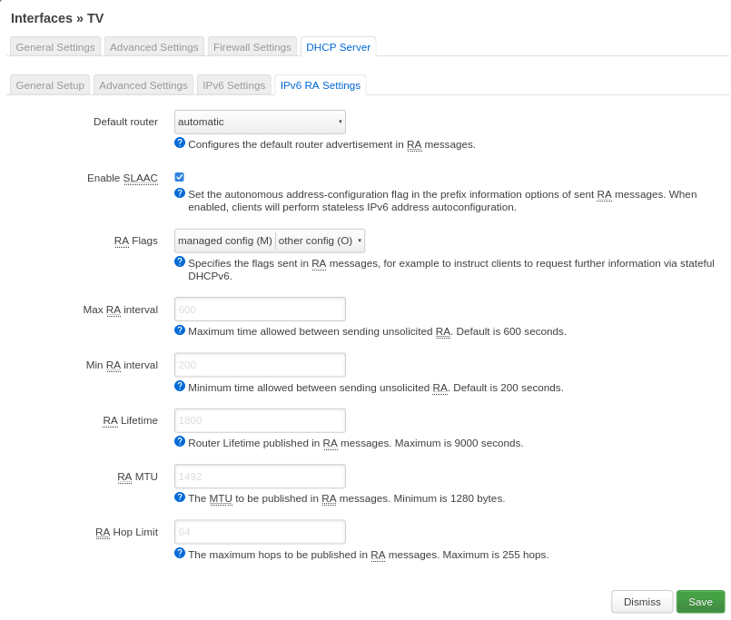

# Router

[1. Introduction](#introduction)

[2. Official sysupgrade .bin](#official-sysupgrade-bin)

[3. Image Builder sysupgrade .bin w/o modifications](#image-builder-sysupgrade-bin-wo-modifications)

[4. Custom sysupgrade .bin](#custom-sysupgrade-bin)

[5. Basic Configuration](#basic-configuration)

[6. Advanced Configuration](#advanced-configuration)

## Introduction

Packages can be installed with `opkg` or over the web interface (aka `luci`) on devices with large storage capacity. In contrast to my modem setup, I don't have the requirement of keeping the image as small as possible. Nevertheless, I still prefer building my own image with OpenWrt's [Image Builder](https://openwrt.org/docs/guide-user/additional-software/imagebuilder), especially with the requirement of replacing DNSMasq with Unbound and Dropbear with OpenSSH.

```bash
local $ ls -1
openwrt-21.02.1-ipq806x-generic-tplink_c2600-squashfs-sysupgrade.bin
openwrt-imagebuilder-21.02.1-ipq806x-generic.Linux-x86_64.tar.xz
sha256sums
sha256sums.asc
```

Above files are downloaded from [openwrt.org](https://downloads.openwrt.org/releases/21.02.1/targets/ipq806x/generic/).

## Prepare the system

If you don't like to run foreign scripts on your machine you can [prepare a virtual system](https://github.com/duxsco/gpg-smartcard#prepare-the-system) and install [required dependencies](https://openwrt.org/docs/guide-user/additional-software/imagebuilder#debianubuntu).

## Official sysupgrade .bin

Flash the official sysupgrade .bin:

```bash
remote $ sha256sum /tmp/openwrt-21.02.1-ipq806x-generic-tplink_c2600-squashfs-sysupgrade.bin | grep 34fad9b82c4b0ed29aacbd86c471b9b2329af5fdf1af0ae7ebbd8d162d97aaef
remote $ sysupgrade -n -v /tmp/openwrt-21.02.1-ipq806x-generic-tplink_c2600-squashfs-sysupgrade.bin
Commencing upgrade. Closing all shell sessions.
Connection to 192.168.0.1 closed by remote host.
Connection to 192.168.0.1 closed.
```

..., ssh into your router after reboot with `ssh root@192.168.1.1` and list packages without any dependencies:

```bash
remote $ opkg list-installed | awk '{print $1}' | while read I; do if [ $(opkg whatdepends "$I" | wc -l) -eq 3 ]; then echo "$I"; fi; done
ath10k-firmware-qca99x0-ct
base-files
busybox
ca-bundle
dnsmasq
dropbear
ip6tables
iwinfo
kmod-ata-ahci
kmod-ata-ahci-platform
kmod-ath10k-ct
kmod-gpio-button-hotplug
kmod-ipt-offload
kmod-leds-gpio
kmod-phy-qcom-ipq806x-usb
kmod-usb-dwc3-qcom
kmod-usb-ledtrig-usbport
kmod-usb-ohci
kmod-usb2
kmod-usb3
logd
luci-ssl
mtd
odhcp6c
odhcpd-ipv6only
ppp
ppp-mod-pppoe
procd
swconfig
uboot-envtools
uci
urandom-seed
urngd
wpad-basic-wolfssl
```

## Image Builder sysupgrade .bin w/o modifications

Use OpenWrt's [Image Builder](https://openwrt.org/docs/guide-user/additional-software/imagebuilder) ...:

```bash
local $ tar xvf openwrt-imagebuilder-21.02.1-ipq806x-generic.Linux-x86_64.tar.xz; echo $?
local $ cd openwrt-imagebuilder-21.02.1-ipq806x-generic.Linux-x86_64/
local $ make help
local $ make image PROFILE="tplink_c2600"; echo $?
local $ scp bin/targets/ipq806x/generic/openwrt-21.02.1-ipq806x-generic-tplink_c2600-squashfs-sysupgrade.bin root@192.168.1.1:/tmp/
local $ grep "openwrt-21.02.1-ipq806x-generic-tplink_c2600-squashfs-sysupgrade.bin" bin/targets/ipq806x/generic/sha256sums | sed 's#*# /tmp/#' | ssh root@192.168.1.1 "dd of=/tmp/sha256.txt"
```

..., flash your router:

```bash
remote $ sha256sum -c /tmp/sha256.txt
/tmp/openwrt-21.02.1-ipq806x-generic-tplink_c2600-squashfs-sysupgrade.bin: OK
remote $ sysupgrade -n -v /tmp/openwrt-21.02.1-ipq806x-generic-tplink_c2600-squashfs-sysupgrade.bin
Commencing upgrade. Closing all shell sessions.
Connection to 192.168.1.1 closed by remote host.
Connection to 192.168.1.1 closed.
```

... and create the package list without dependencies again:

```bash
remote $ opkg list-installed | awk '{print $1}' | while read I; do if [ $(opkg whatdepends "$I" | wc -l) -eq 3 ]; then echo "$I"; fi; done
ath10k-firmware-qca99x0-ct
base-files
busybox
ca-bundle
dnsmasq
dropbear
firewall
ip6tables
kmod-ata-ahci
kmod-ata-ahci-platform
kmod-ath10k-ct
kmod-gpio-button-hotplug
kmod-ipt-offload
kmod-leds-gpio
kmod-phy-qcom-ipq806x-usb
kmod-usb-dwc3-qcom
kmod-usb-ledtrig-usbport
kmod-usb-ohci
kmod-usb2
kmod-usb3
libustream-wolfssl20201210
logd
mtd
odhcp6c
odhcpd-ipv6only
opkg
ppp
ppp-mod-pppoe
procd
swconfig
uboot-envtools
uci
urandom-seed
urngd
wpad-basic-wolfssl
```

## Custom sysupgrade .bin

**Now, you have an overview of what packages above two images come with.**

I build my image using the [package list from the official OpenWrt image](#official-sysupgrade-bin) with some customisations:

  - Use `chrony-nts` instead of the provided NTP service
  - Replace `dnsmasq` with `luci-app-unbound` to have a validating, recursive, caching DNS resolver. As [dnsmasq also takes care of DHCP over IPv4](https://openwrt.org/docs/guide-user/base-system/dhcp), I need to replace `odhcpd-ipv6only` with `odhcpd` to have DHCPv6 as well as DHCP served.
  - Replace `dropbear` with `openssh-server`
  - Install tools `diffutils`, `fdisk`, `rsync` and `vim-fuller`
  - Install `luci-app-wireguard` for VPN.
  - Install packages needed to host your gopass/pass Git repos on usb ⇨ `btrfs raid1`

While building the image with OpenWrt's [Image Builder](https://openwrt.org/docs/guide-user/additional-software/imagebuilder), you have to explicitly exclude/include packages from the [standard set](#image-builder-sysupgrade-bin-wo-modifications). **I create my image with above customisations as shown in the following code blocks.**

First, extract the Image Builder archive:

```bash
local $ tar xvf openwrt-imagebuilder-21.02.1-ipq806x-generic.Linux-x86_64.tar.xz; echo $?
local $ cd openwrt-imagebuilder-21.02.1-ipq806x-generic.Linux-x86_64/
local $ make help
```

The following commands need to be executed on the local machine. I removed `local $` to ease copy&paste. You can get some info on a certain package at `https://openwrt.org/packages/pkgdata/<PACKAGE_NAME>` (e.g. https://openwrt.org/packages/pkgdata/urngd) or via [package table](https://openwrt.org/packages/table/start).

```bash
PKG_CHRONY="chrony-nts" # use chrony
PKG_DEFAULT="iwinfo luci" # packages delivered with official image
PKG_DHCP="-odhcpd-ipv6only odhcpd" # make odhcpd support DHCPv4, because Dnsmasq doesn't take care of this anymore
PKG_DNS="-dnsmasq luci-app-unbound" # use Unbound
PKG_SSH="-dropbear openssh-server" # use openssh
PKG_TOOLS="diffutils fdisk rsync vim-fuller"
PKG_VPN="luci-app-wireguard" # support WireGuard
PKG_GOPASS="kmod-usb-storage block-mount blkid btrfs-progs usbutils git" # allow storing git files on usb->raid1->ext4 and manage non-root user
```

Furthermore, I integrate following files/folder with these perms into the image. You need to make sure that the `authorized_keys` file contains your SSH public keys.

```bash
local $ find files -exec ls -ld {} + | awk '{print $1"  "$NF}'
drwxr-xr-x  files
drwx------  files/root
drwx------  files/root/.ssh
-rw-------  files/root/.ssh/authorized_keys
drwxr-xr-x  files/usr
drwxr-xr-x  files/usr/local
drwxr-xr-x  files/usr/local/bin
-rwxr-xr-x  files/usr/local/bin/git-wrapper.sh
```

`git-wrapper.sh` will be used later on to restrict access to the gopass/pass Git repo.

Build and copy the image:

```bash
local $ make image PROFILE="tplink_c2600" PACKAGES="$PKG_CHRONY $PKG_DEFAULT $PKG_DHCP $PKG_DNS $PKG_SSH $PKG_TOOLS $PKG_VPN $PKG_GOPASS" FILES="files/"; echo $?
local $ scp bin/targets/ipq806x/generic/openwrt-21.02.1-ipq806x-generic-tplink_c2600-squashfs-sysupgrade.bin root@192.168.1.1:/tmp/
local $ grep "openwrt-21.02.1-ipq806x-generic-tplink_c2600-squashfs-sysupgrade.bin" bin/targets/ipq806x/generic/sha256sums | sed 's#*# /tmp/#' | ssh root@192.168.1.1 "dd of=/tmp/sha256.txt"
```

Flash the image:

```bash
remote $ sha256sum -c /tmp/sha256.txt
/tmp/openwrt-21.02.1-ipq806x-generic-tplink_c2600-squashfs-sysupgrade.bin: OK
remote $ sysupgrade -n -v /tmp/openwrt-21.02.1-ipq806x-generic-tplink_c2600-squashfs-sysupgrade.bin
Commencing upgrade. Closing all shell sessions.
Connection to 192.168.1.1 closed by remote host.
Connection to 192.168.1.1 closed.
```

You need to set a static IP address in the range of 192.168.1.2-192.168.1.254 with netmask 255.255.255.0 on your working machine, because the router doesn't provide DHCP at this point.

Login into the router with `ssh root@192.168.1.1`.

Here is my custom package list without dependencies:

```bash
remote $ opkg list-installed | awk '{print $1}' | while read I; do if [ $(opkg whatdepends "$I" | wc -l) -eq 3 ]; then echo "$I"; fi; done
ath10k-firmware-qca99x0-ct
base-files
blkid
block-mount
btrfs-progs
busybox
chrony-nts
diffutils
fdisk
git
ip6tables
iwinfo
kmod-ata-ahci
kmod-ata-ahci-platform
kmod-ath10k-ct
kmod-gpio-button-hotplug
kmod-ipt-offload
kmod-leds-gpio
kmod-phy-qcom-ipq806x-usb
kmod-usb-dwc3-qcom
kmod-usb-ledtrig-usbport
kmod-usb-ohci
kmod-usb-storage
kmod-usb2
kmod-usb3
libustream-wolfssl20201210
logd
luci
luci-app-unbound
luci-app-wireguard
mtd
odhcp6c
odhcpd
openssh-server
ppp
ppp-mod-pppoe
procd
rsync
swconfig
uboot-envtools
uci
urandom-seed
urngd
usbutils
vim-fuller
wpad-basic-wolfssl
```

## Basic Configuration

**In the code blocks below, I list the commands used to configure the router to get internet up and running.**

After making changes over the web interface (aka `luci`), click on `Save` and click on `UNSAVED CHANGES: #`, highlighted in **blue**, in the upper right corner of `luci`. Then, the commands that are going to be applied with a click on `Save & Apply` are listed in a popup. You can compare them with mine below.


### System ⇨ System

```
# /etc/config/system
uci del system.ntp.enable_server
uci del system.ntp.server
uci set system.cfg01e48a.hostname='mimo'
uci set system.cfg01e48a.zonename='Europe/Berlin'
uci set system.cfg01e48a.timezone='CET-1CEST,M3.5.0,M10.5.0/3'
uci set system.cfg01e48a.log_proto='udp'
uci set system.cfg01e48a.conloglevel='8'
uci set system.cfg01e48a.cronloglevel='5'
uci set system.ntp.enabled='0'
```

### System ⇨ Administration

Set a password.

SSH into the router with `ssh root@192.168.1.1` and setup OpenSSH:

```bash
remote $ cp -av /etc/ssh/sshd_config /etc/ssh/sshd_config.old
remote $ sed -i \
-e 's/^#Port 22$/Port 50022/' \
-e 's/^#PasswordAuthentication yes/PasswordAuthentication no/' \
-e 's/^#ChallengeResponseAuthentication yes$/ChallengeResponseAuthentication no/' \
-e 's/^#X11Forwarding no$/X11Forwarding no/' /etc/ssh/sshd_config
remote $ cat <<EOF >> /etc/ssh/sshd_config

KexAlgorithms curve25519-sha256,curve25519-sha256@libssh.org
HostKeyAlgorithms ssh-ed25519
Ciphers chacha20-poly1305@openssh.com,aes128-gcm@openssh.com,aes256-gcm@openssh.com
MACs hmac-sha2-256-etm@openssh.com,hmac-sha2-512-etm@openssh.com,hmac-sha2-256,hmac-sha2-512

AllowUsers root
EOF
remote $ /etc/init.d/sshd restart
```

Beware that you will only be able to login via SSH over port 50022 or whatever port you have chosen.

### Services ⇨ Recursive DNS

```
# /etc/config/unbound
uci set unbound.ub_main.enabled='1'
uci set unbound.ub_main.validator='1'
uci set unbound.ub_main.rebind_localhost='1'
uci del unbound.ub_main.dns64_prefix
uci del unbound.ub_main.iface_trig
uci add_list unbound.ub_main.iface_trig='lan'
uci add_list unbound.ub_main.iface_trig='wan'
uci set unbound.ub_main.dhcp_link='odhcpd'
uci del unbound.ub_main.dhcp4_slaac6
uci del unbound.ub_main.query_minimize
uci del unbound.ub_main.query_min_strict
```

Optional, but [recommended](https://www.kuketz-blog.de/empfehlungsecke/#dns):

```
# /etc/config/unbound
uci del unbound.fwd_google.server
uci add_list unbound.fwd_google.server='5.1.66.255'
uci add_list unbound.fwd_google.server='185.150.99.255'
uci add_list unbound.fwd_google.server='2001:678:e68:f000::'
uci add_list unbound.fwd_google.server='2001:678:ed0:f000::'
uci set unbound.fwd_google.dns_assist='none'
uci set unbound.fwd_google.tls_port='853'
uci set unbound.fwd_google.tls_index='dot.ffmuc.net'
uci del unbound.fwd_cloudflare.server
uci add_list unbound.fwd_cloudflare.server='5.9.164.112'
uci add_list unbound.fwd_cloudflare.server='2a01:4f8:251:554::2'
uci set unbound.fwd_cloudflare.dns_assist='none'
uci set unbound.fwd_cloudflare.tls_port='853'
uci set unbound.fwd_cloudflare.tls_index='dns3.digitalcourage.de'
```

### Network ⇨ Interfaces ⇨ LAN

If you change the IP of the LAN interface like I do you need to change the static IP on your working machine accordingly and access the router's web interface available at the new IP within a certain time. Otherwise, the IP settings of the router are reverted.

```
# /etc/config/dhcp
uci del dhcp.lan.ra_slaac
uci del dhcp.lan.domain
uci add_list dhcp.lan.domain='lan'
# /etc/config/network
uci set network.lan.ipaddr='192.168.0.1'
```

### Network ⇨ Interfaces ⇨ WAN

```
# /etc/config/network
uci set network.wan.proto='pppoe'
uci set network.wan.username='XXX'
uci set network.wan.password='XXX'
uci set network.wan.ipv6='auto'
uci set network.wan.keepalive='3 5'
uci set network.wan.peerdns='0'
uci add_list network.wan.dns='127.0.0.1'
```

### Network ⇨ Interfaces ⇨ WAN6

```
# /etc/config/network
uci set network.wan6.reqaddress='try'
uci set network.wan6.reqprefix='auto'
uci set network.wan6.peerdns='0'
uci add_list network.wan6.dns='::1'
```

### Network ⇨ Wireless

```
# /etc/config/wireless
uci set wireless.radio0.htmode='VHT40'
uci set wireless.radio0.channel='auto'
uci set wireless.radio0.country='DE'
uci set wireless.radio0.cell_density='0'
uci set wireless.default_radio0.ssid='XXX'
uci set wireless.default_radio0.encryption='sae-mixed'
uci set wireless.default_radio0.key='XXX'
uci set wireless.default_radio0.wpa_disable_eapol_key_retries='1'
uci set wireless.radio1.channel='auto'
uci set wireless.radio1.country='DE'
uci set wireless.radio1.cell_density='0'
uci set wireless.default_radio1.ssid='XXX'
uci set wireless.default_radio1.encryption='sae-mixed'
uci set wireless.default_radio1.key='XXX'
uci set wireless.default_radio1.wpa_disable_eapol_key_retries='1'
```

... and enable Wifi.

### Configuration over SSH

In contrast to Dnsmasq, DHCPv4 configuration over `luci` is limited for odhcpd. Thus, I need to [execute the following over SSH](https://openwrt.org/docs/guide-user/base-system/dhcp_configuration#replacing_dnsmasq_with_odhcpd_and_unbound):

```bash
remote $ uci set dhcp.lan.dhcpv4="server"
remote $ uci set dhcp.odhcpd.maindhcp="1"
remote $ uci set dhcp.odhcpd.leasetrigger="/usr/lib/unbound/odhcpd.sh"
remote $ uci set unbound.@unbound[0].unbound_control="1"
remote $ uci commit dhcp
remote $ /etc/init.d/odhcpd restart
remote $ uci commit unbound
remote $ /etc/init.d/unbound restart
```

Furthermore, you need:

```bash
remote $ uci set ucitrack.@dhcp[0].init='odhcpd'
remote $ uci commit ucitrack
remote $ /etc/init.d/ucitrack restart
```

### Network ⇨ Firewall ⇨ "General Settings"

Drop invalid packets:

```bash
# /etc/config/firewall
uci del firewall.cfg01e63d.syn_flood
uci set firewall.cfg01e63d.synflood_protect='1'
uci set firewall.cfg01e63d.drop_invalid='1'
```

## Advanced Configuration

With the help of the [Basic Configuration](#basic-configuration) I have internet up and running. Now, I am going to take care of the more advanced stuff.

### Harden http/https access

Execute this over SSH to make `luci` listen only on localhost:

```bash
uci -q delete uhttpd.main.listen_http && \
uci add_list uhttpd.main.listen_http="127.0.0.1:80" && \
uci add_list uhttpd.main.listen_http="[::1]:80" && \
uci -q delete uhttpd.main.listen_https && \
uci add_list uhttpd.main.listen_https="127.0.0.1:443" && \
uci add_list uhttpd.main.listen_https="[::1]:443" && \
uci commit uhttpd && \
/etc/init.d/uhttpd restart; echo $?
```

To access `luci` execute `ssh -NL 8080:localhost:80 -p 50022 root@192.168.0.1` and visit http://localhost:8080

### Chrony

Chrony cannot be configured via luci. Thus, you need to use `uci`. The default config:

```bash
remote $ uci show chrony
chrony.@pool[0]=pool
chrony.@pool[0].hostname='2.openwrt.pool.ntp.org'
chrony.@pool[0].maxpoll='12'
chrony.@pool[0].iburst='yes'
chrony.@dhcp_ntp_server[0]=dhcp_ntp_server
chrony.@dhcp_ntp_server[0].iburst='yes'
chrony.@dhcp_ntp_server[0].disabled='no'
chrony.@allow[0]=allow
chrony.@allow[0].interface='lan'
chrony.@makestep[0]=makestep
chrony.@makestep[0].threshold='1.0'
chrony.@makestep[0].limit='3'
chrony.@nts[0]=nts
chrony.@nts[0].rtccheck='yes'
chrony.@nts[0].systemcerts='yes'
```

My changes:

```bash
uci set chrony.@nts[-1].trustedcerts='/etc/ssl/certs/ca-certificates.crt'
uci delete chrony.@pool[0]
uci add chrony server
uci set chrony.@server[-1].hostname='time.cloudflare.com'
uci set chrony.@server[-1].iburst='yes'
uci set chrony.@server[-1].nts='yes'
uci add chrony server
uci set chrony.@server[-1].hostname='nts.netnod.se'
uci set chrony.@server[-1].iburst='yes'
uci set chrony.@server[-1].nts='yes'
uci add chrony server
uci set chrony.@server[-1].hostname='nts.time.nl'
uci set chrony.@server[-1].iburst='yes'
uci set chrony.@server[-1].nts='yes'
uci add chrony server
uci set chrony.@server[-1].hostname='ptbtime1.ptb.de'
uci set chrony.@server[-1].iburst='yes'
uci set chrony.@server[-1].nts='yes'
uci add chrony server
uci set chrony.@server[-1].hostname='ptbtime2.ptb.de'
uci set chrony.@server[-1].iburst='yes'
uci set chrony.@server[-1].nts='yes'
uci add chrony server
uci set chrony.@server[-1].hostname='ptbtime3.ptb.de'
uci set chrony.@server[-1].iburst='yes'
uci set chrony.@server[-1].nts='yes'
uci commit chrony
/etc/init.d/chronyd restart
```

List the servers:

```bash
remote $ chronyc sources
MS Name/IP address         Stratum Poll Reach LastRx Last sample
===============================================================================
^* time.cloudflare.com           3   6    17    63   -279us[ -107us] +/-   13ms
^+ ntsts.sth.ntp.se              2   6    17    64   +864us[+1036us] +/-   16ms
^+ nts1.time.nl                  2   6    17    63  -3369us[-3197us] +/-   35ms
^+ ptbtime1.ptb.de               1   6    17    63   -558us[ -385us] +/-   16ms
^+ ptbtime2.ptb.de               1   6    17    63  +2170us[+2342us] +/-   13ms
^+ ptbtime3.ptb.de               1   6    17    63   -852us[ -679us] +/-   16ms
```

### gopass/pass

Adjust `/dev/sda1` and `/dev/sdb1` as you see fit. If the btrfs RAID has not been assembled, do:

```bash
remote $ lsusb -t
remote $ blkid /dev/sd[a-z]1
remote $ mkfs.btrfs -d raid1 -m raid1 /dev/sda1 /dev/sdb1
remote $ blkid /dev/sda1
/dev/sda1: UUID="XXXXXXXX-XXXX-XXXX-XXXX-XXXXXXXXXXXX" UUID_SUB="YYYYYYYY-YYYY-YYYY-YYYY-YYYYYYYYYYYY" BLOCK_SIZE="4096" TYPE="btrfs" PARTUUID="ZZZZZZZZ-ZZZZ-ZZZZ-ZZZZ-ZZZZZZZZZZZZ"
```

Get a sample fstab UCI subsystem configuration file ([further info](https://openwrt.org/docs/guide-user/storage/fstab)):

```bash
remote $ block detect | uci import fstab
```

Show fstab configuration:

```bash
remote $ uci show fstab
fstab.@global[0]=global
fstab.@global[0].anon_swap='0'
fstab.@global[0].anon_mount='0'
fstab.@global[0].auto_swap='1'
fstab.@global[0].auto_mount='1'
fstab.@global[0].delay_root='5'
fstab.@global[0].check_fs='0'
fstab.@mount[0]=mount
fstab.@mount[0].target='/mnt/sda1'
fstab.@mount[0].uuid='XXXXXXXX-XXXX-XXXX-XXXX-XXXXXXXXXXXX'
fstab.@mount[0].enabled='0'
fstab.@mount[1]=mount
fstab.@mount[1].target='/mnt/sdb1'
fstab.@mount[1].uuid='XXXXXXXX-XXXX-XXXX-XXXX-XXXXXXXXXXXX'
fstab.@mount[1].enabled='0'
```

Delete extraneous fstab entry:

```bash
remote $ uci del fstab.@mount[1]
```

Set `noatime` mount option:

```bash
remote $ uci set fstab.@mount[0].options="noatime"
remote $ uci commit fstab.@mount[0]
```

Create mountpoint, use mountpoint and enable the fstab entry:

```bash
remote $ mkdir /mnt/usb
remote $ uci set fstab.@mount[0].target='/mnt/usb'
remote $ uci set fstab.@mount[0].enabled='1'
remote $ uci commit fstab.@mount[0]
```

Reboot your router and check whether the btrfs RAID has been mounted to `/mnt/usb`:

```bash
remote $ mount | grep mnt
/dev/sda1 on /mnt/usb type btrfs (rw,relatime,noacl,space_cache,subvolid=5,subvol=/)
```

Setup Git repository on the RAID device:

```bash
remote $ mkdir /mnt/usb/pass
remote $ git config --global init.defaultBranch main # creates /root/.gitconfig
remote $ git init --bare /mnt/usb/pass/.git
```

Create an additional SSH ed25519 keypair for restricted access and upload it:

```bash
local $ ssh-keygen -t ed25519 -f ~/.ssh/id_ed25519_pass
local $ cat ~/.ssh/id_ed25519_pass.pub | sed 's#^#restrict,command="/usr/local/bin/git-wrapper.sh" #' | ssh -p 50022 root@192.168.0.1 "cat - >> /root/.ssh/authorized_keys"
```

Infos on the options can be found here:
https://linux.die.net/man/8/sshd

**The configuration expects the gopass/pass Git repo to be stored as `/mnt/usb/pass/.git`.**

On my laptop, I have the following settings:

```bash
local $ cd ~/.password-store
local $ git remote -v
origin  pass:/mnt/usb/pass/.git (fetch)
origin  pass:/mnt/usb/pass/.git (push)
local $ grep -A4 "Host pass"  ~/.ssh/config
Host pass
User root
HostName 192.168.0.1
Port 50022
IdentityFile ~/.ssh/id_ed25519_pass
```

### WireGuard

For WireGuard to work we need certain firewall rules. I will go in depth in the following chapters. The result is displayed in these screenshots that are only showing the created firewall rules for shortness sake:


#### Create WireGuard files

Execute these commands on the router:

```bash
remote $ ( umask go= && \
wg genkey | tee /tmp/wg_router.key | wg pubkey > /tmp/wg_router.pub && \
wg genpsk > /tmp/wg_router.psk )
```

Execute these commands on the vServer:

```bash
remote $ ( umask go= && \
wg genkey | tee /tmp/wg_vserver.key | wg pubkey > /tmp/wg_vserver.pub )
```

#### Network ⇨ Firewall ⇨ "General Settings"

A firewall zone needs to be created. I **only** enable outgoing traffic.


Disable IPv6:


The resulting commands:

```
# /etc/config/firewall
uci add firewall zone # =cfg10dc81
uci set firewall.@zone[-1].name='whitehouse'
uci set firewall.@zone[-1].input='REJECT'
uci set firewall.@zone[-1].output='ACCEPT'
uci set firewall.@zone[-1].forward='REJECT'
uci set firewall.@zone[-1].family='ipv4'
```

#### Network ⇨ Interfaces

  1. Click "Add new interface..."
  2. Name your Wireguard VPN, set "Protocol" to "Wireguard VPN" and click "Create Interface"
  3. Configure as shown in these screenshots:


```
# /etc/config/firewall
uci add_list firewall.cfg10dc81.network='whitehouse'
# /etc/config/network
uci set network.whitehouse=interface
uci set network.whitehouse.proto='wireguard'
uci add network wireguard_whitehouse # =cfg0b9cf3
uci set network.whitehouse.private_key='$(cat /tmp/wg_router.key)'
uci add_list network.whitehouse.addresses='172.16.0.2/24'
uci set network.whitehouse.defaultroute='0'
uci set network.whitehouse.peerdns='0'
uci set network.@wireguard_whitehouse[-1].description='whitehouse'
uci set network.@wireguard_whitehouse[-1].public_key='$(cat /tmp/wg_vserver.pub)'
uci set network.@wireguard_whitehouse[-1].preshared_key='$(cat /tmp/wg_router.psk)'
uci add_list network.@wireguard_whitehouse[-1].allowed_ips='172.16.0.1/32'
uci set network.@wireguard_whitehouse[-1].endpoint_host='<PUBLIC STATIC IP OF VSERVER>'
uci set network.@wireguard_whitehouse[-1].endpoint_port='51820'
uci set network.@wireguard_whitehouse[-1].persistent_keepalive='25'
```

#### Network ⇨ Firewall ⇨ "Traffic Rules" (Filter)


```
# /etc/config/firewall
uci add firewall rule # =cfg1192bd
uci set firewall.@rule[-1].name='certbot'
uci set firewall.@rule[-1].family='ipv4'
uci add_list firewall.@rule[-1].proto='tcp'
uci set firewall.@rule[-1].src='whitehouse'
uci add_list firewall.@rule[-1].src_ip='172.16.0.1'
uci set firewall.@rule[-1].dest='lan'
uci add_list firewall.@rule[-1].dest_ip='192.168.0.2'
uci set firewall.@rule[-1].dest_port='80'
uci set firewall.@rule[-1].target='ACCEPT'
uci set firewall.@rule[-1].extra='-m conntrack --ctstate NEW'
```


```
# /etc/config/firewall
uci add firewall rule # =cfg1292bd
uci set firewall.@rule[-1].name='smtp'
uci set firewall.@rule[-1].family='ipv4'
uci add_list firewall.@rule[-1].proto='tcp'
uci set firewall.@rule[-1].src='whitehouse'
uci add_list firewall.@rule[-1].src_ip='172.16.0.1'
uci set firewall.@rule[-1].dest='lan'
uci add_list firewall.@rule[-1].dest_ip='192.168.0.2'
uci set firewall.@rule[-1].dest_port='50587'
uci set firewall.@rule[-1].target='ACCEPT'
uci set firewall.@rule[-1].extra='-m conntrack --ctstate NEW'
```


```
# /etc/config/firewall
uci add firewall rule # =cfg1392bd
uci set firewall.@rule[-1].name='imap'
uci set firewall.@rule[-1].family='ipv4'
uci add_list firewall.@rule[-1].proto='tcp'
uci set firewall.@rule[-1].src='whitehouse'
uci add_list firewall.@rule[-1].src_ip='172.16.0.1'
uci set firewall.@rule[-1].dest='lan'
uci add_list firewall.@rule[-1].dest_ip='192.168.0.2'
uci set firewall.@rule[-1].dest_port='50993'
uci set firewall.@rule[-1].target='ACCEPT'
uci set firewall.@rule[-1].extra='-m conntrack --ctstate NEW'
```

#### Network ⇨ Firewall ⇨ "Port Forwards" (DNAT)


```
# /etc/config/firewall
uci add firewall redirect # =cfg143837
uci set firewall.@redirect[-1].target='DNAT'
uci set firewall.@redirect[-1].name='certbot'
uci add_list firewall.@redirect[-1].proto='tcp'
uci set firewall.@redirect[-1].src='whitehouse'
uci set firewall.@redirect[-1].src_ip='172.16.0.1'
uci set firewall.@redirect[-1].src_dip='172.16.0.2'
uci set firewall.@redirect[-1].src_dport='80'
uci set firewall.@redirect[-1].dest='lan'
uci set firewall.@redirect[-1].dest_ip='192.168.0.2'
uci set firewall.@redirect[-1].reflection='0'
```


```
# /etc/config/firewall
uci add firewall redirect # =cfg153837
uci set firewall.@redirect[-1].target='DNAT'
uci set firewall.@redirect[-1].name='smtp'
uci add_list firewall.@redirect[-1].proto='tcp'
uci set firewall.@redirect[-1].src='whitehouse'
uci set firewall.@redirect[-1].src_ip='172.16.0.1'
uci set firewall.@redirect[-1].src_dip='172.16.0.2'
uci set firewall.@redirect[-1].src_dport='50587'
uci set firewall.@redirect[-1].dest='lan'
uci set firewall.@redirect[-1].dest_ip='192.168.0.2'
uci set firewall.@redirect[-1].reflection='0'
```


```
# /etc/config/firewall
uci add firewall redirect # =cfg163837
uci set firewall.@redirect[-1].target='DNAT'
uci set firewall.@redirect[-1].name='imap'
uci add_list firewall.@redirect[-1].proto='tcp'
uci set firewall.@redirect[-1].src='whitehouse'
uci set firewall.@redirect[-1].src_ip='172.16.0.1'
uci set firewall.@redirect[-1].src_dip='172.16.0.2'
uci set firewall.@redirect[-1].src_dport='50993'
uci set firewall.@redirect[-1].dest='lan'
uci set firewall.@redirect[-1].dest_ip='192.168.0.2'
uci set firewall.@redirect[-1].reflection='0'
```

#### Network ⇨ Firewall ⇨ "NAT Rules" (SNAT)


```
# /etc/config/firewall
uci add firewall nat # =cfg1793c8
uci set firewall.@nat[-1].name='certbot'
uci add_list firewall.@nat[-1].proto='tcp'
uci set firewall.@nat[-1].src='lan'
uci set firewall.@nat[-1].src_ip='172.16.0.1'
uci set firewall.@nat[-1].dest_ip='192.168.0.2'
uci set firewall.@nat[-1].dest_port='80'
uci set firewall.@nat[-1].target='SNAT'
uci set firewall.@nat[-1].snat_ip='192.168.0.1'
```


```
# /etc/config/firewall
uci add firewall nat # =cfg1893c8
uci set firewall.@nat[-1].name='smtp'
uci add_list firewall.@nat[-1].proto='tcp'
uci set firewall.@nat[-1].src='lan'
uci set firewall.@nat[-1].src_ip='172.16.0.1'
uci set firewall.@nat[-1].dest_ip='192.168.0.2'
uci set firewall.@nat[-1].dest_port='50587'
uci set firewall.@nat[-1].target='SNAT'
uci set firewall.@nat[-1].snat_ip='192.168.0.1'
```


```
# /etc/config/firewall
uci add firewall nat # =cfg1993c8
uci set firewall.@nat[-1].name='imap'
uci add_list firewall.@nat[-1].proto='tcp'
uci set firewall.@nat[-1].src='lan'
uci set firewall.@nat[-1].src_ip='172.16.0.1'
uci set firewall.@nat[-1].dest_ip='192.168.0.2'
uci set firewall.@nat[-1].dest_port='50993'
uci set firewall.@nat[-1].target='SNAT'
uci set firewall.@nat[-1].snat_ip='192.168.0.1'
```

#### Network ⇨ Firewall ⇨ "Custom Rules" (Reflection)

Don't forget to set the IP of the vServer:

```
# make mail server accessible to lan in case of internet downtime
iptables -t nat -A prerouting_lan_rule -d <PUBLIC STATIC IP OF VSERVER> -p tcp -m multiport --dports 50587,50993 -j DNAT --to-destination 192.168.0.2 -m comment --comment "mail reflection"
iptables -t nat -A postrouting_lan_rule -d 192.168.0.2 -p tcp -m multiport --dports 50587,50993 -j SNAT --to-source 192.168.0.1 -m comment --comment "mail reflection"
```

#### Network ⇨ Hostnames

Add an entry for the public static IP address of the vServer. Otherwise, the two iptables rules in [this chapter](#network--firewall--custom-rules-reflection) won't work.

### Guest Wifi for Smart-TV

I like to have my Smart-TV in a guest Wifi, separated from my LAN.

#### Network ⇨ Interfaces ⇨ Devices

First, create a bridge device. Otherwise, you'll have [problems with DHCP and DNS](https://forum.openwrt.org/t/master-guest-network-not-working-dhcp-packet-received-on-wlan0-which-has-no-address/74138).

```
# /etc/config/network
uci add network device # =cfg0c0f15
uci set network.@device[-1].type='bridge'
uci set network.@device[-1].name='br-tv'
```

#### Network ⇨ Firewall ⇨ "General Settings"

Create a firewall zone as shown in [Network ⇨ Firewall ⇨ "General Settings"](#network--firewall--general-settings-1). Just replace "whitehouse" with "tv", don't disable IPv6 and allow ingoing traffic:

```
# /etc/config/firewall
uci add firewall zone # =cfg1adc81
uci set firewall.@zone[-1].name='tv'
uci set firewall.@zone[-1].input='ACCEPT'
uci set firewall.@zone[-1].output='ACCEPT'
uci set firewall.@zone[-1].forward='REJECT'
```

#### Network ⇨ Interfaces

Create the `tv` interface:




```
# /etc/config/dhcp
uci set dhcp.tv=dhcp
uci set dhcp.tv.interface='tv'
uci set dhcp.tv.start='100'
uci set dhcp.tv.limit='150'
uci set dhcp.tv.leasetime='12h'
uci set dhcp.tv.ra='server'
uci add_list dhcp.tv.ra_flags='managed-config'
uci add_list dhcp.tv.ra_flags='other-config'
uci set dhcp.tv.dhcpv6='server'
# /etc/config/firewall
uci add_list firewall.cfg1adc81.network='tv'
# /etc/config/network
uci set network.tv=interface
uci set network.tv.proto='static'
uci set network.tv.device='br-tv'
uci set network.tv.ipaddr='192.168.1.1'
uci set network.tv.netmask='255.255.255.0'
uci set network.tv.ip6assign='60'
```

Connect to the router via SSH and enable DHCPv4:

```bash
remote $ uci set dhcp.tv.dhcpv4="server"
remote $ uci commit dhcp
remote $ /etc/init.d/odhcpd restart
```

#### Network ⇨ Wireless

The wireless network needs to be created:

```
# /etc/config/network
uci set network.tv.type='bridge'
# /etc/config/wireless
uci set wireless.wifinet2=wifi-iface
uci set wireless.wifinet2.device='radio0'
uci set wireless.wifinet2.mode='ap'
uci set wireless.wifinet2.ssid='tv'
uci set wireless.wifinet2.encryption='sae-mixed'
uci set wireless.wifinet2.key='XXX'
uci set wireless.wifinet2.wpa_disable_eapol_key_retries='1'
uci set wireless.wifinet2.network='tv'
uci set wireless.wifinet3=wifi-iface
uci set wireless.wifinet3.device='radio1'
uci set wireless.wifinet3.mode='ap'
uci set wireless.wifinet3.ssid='tv'
uci set wireless.wifinet3.encryption='sae-mixed'
uci set wireless.wifinet3.key='XXX'
uci set wireless.wifinet3.wpa_disable_eapol_key_retries='1'
uci set wireless.wifinet3.network='tv'
```

#### Network ⇨ Firewall ⇨ "General Settings"

Finally, I allow traffic to be forwarded from `tv` zone to `wan` zone. For this purpose, edit `tv` zone and set `wan` at `Allow forward to destination zones:`.

```
# /etc/config/firewall
uci add firewall forwarding # =cfg1bad58
uci set firewall.@forwarding[-1].src='tv'
uci set firewall.@forwarding[-1].dest='wan'
```

### Separate LAN for Webcam

The webcam's base station is connected to the router on port "LAN1" via ethernet. I like to separate this network from LAN via VLAN.

#### Network ⇨ Switch

We need to assign "LAN1" port to a separate VLAN which has port number 3 in below screenshot:


```
# /etc/config/network
uci add network switch_vlan # =cfg0e1ec7
uci set network.@switch_vlan[-1].device='switch0'
uci set network.@switch_vlan[-1].vlan='3'
uci set network.cfg081ec7.vid='1'
uci set network.cfg091ec7.ports='0t 5'
uci set network.cfg091ec7.vid='2'
uci set network.cfg081ec7.ports='1 2 3 6t'
uci set network.@switch_vlan[-1].ports='4 6t'
uci set network.@switch_vlan[-1].vid='3'
```

#### Network ⇨ Firewall ⇨ "General Settings"

A firewall zone as shown in [Network ⇨ Firewall ⇨ "General Settings"](#network--firewall--general-settings-1) needs to be created. Just replace "whitehouse" with "cam", don't disable IPv6 and allow ingoing traffic:

```
# /etc/config/firewall
uci add firewall zone # =cfg1cdc81
uci set firewall.@zone[-1].name='cam'
uci set firewall.@zone[-1].input='ACCEPT'
uci set firewall.@zone[-1].output='ACCEPT'
uci set firewall.@zone[-1].forward='REJECT'
```

#### Network ⇨ Interfaces

Create the `cam` interface as shown in [Network ⇨ Interfaces](#network--interfaces-1). But, change the IP address and assign the interface to device `eth1.3`.

```
# /etc/config/dhcp
uci set dhcp.cam=dhcp
uci set dhcp.cam.interface='cam'
uci set dhcp.cam.start='100'
uci set dhcp.cam.limit='150'
uci set dhcp.cam.leasetime='12h'
uci set dhcp.cam.ra='server'
uci add_list dhcp.cam.ra_flags='managed-config'
uci add_list dhcp.cam.ra_flags='other-config'
uci set dhcp.cam.dhcpv6='server'
# /etc/config/firewall
uci add_list firewall.cfg1cdc81.network='cam'
# /etc/config/network
uci set network.cam=interface
uci set network.cam.proto='static'
uci set network.cam.device='eth1.3'
uci set network.cam.ipaddr='192.168.2.1'
uci set network.cam.netmask='255.255.255.0'
uci set network.cam.ip6assign='60'
```

Connect to the router via SSH and enable DHCPv4:

```bash
remote $ uci set dhcp.cam.dhcpv4="server"
remote $ uci commit dhcp
remote $ /etc/init.d/odhcpd restart
```

#### Network ⇨ Firewall ⇨ "General Settings"

Finally, I allow traffic to be forwarded from `cam` zone to `wan` zone. For this purpose, edit `cam` zone and set `wan` at `Allow forward to destination zones:`.

```
# /etc/config/firewall
uci add firewall forwarding # =cfg1dad58
uci set firewall.@forwarding[-1].src='cam'
uci set firewall.@forwarding[-1].dest='wan'
```
